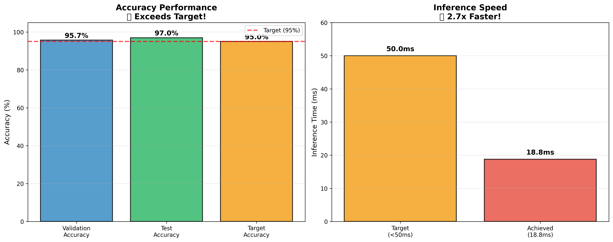
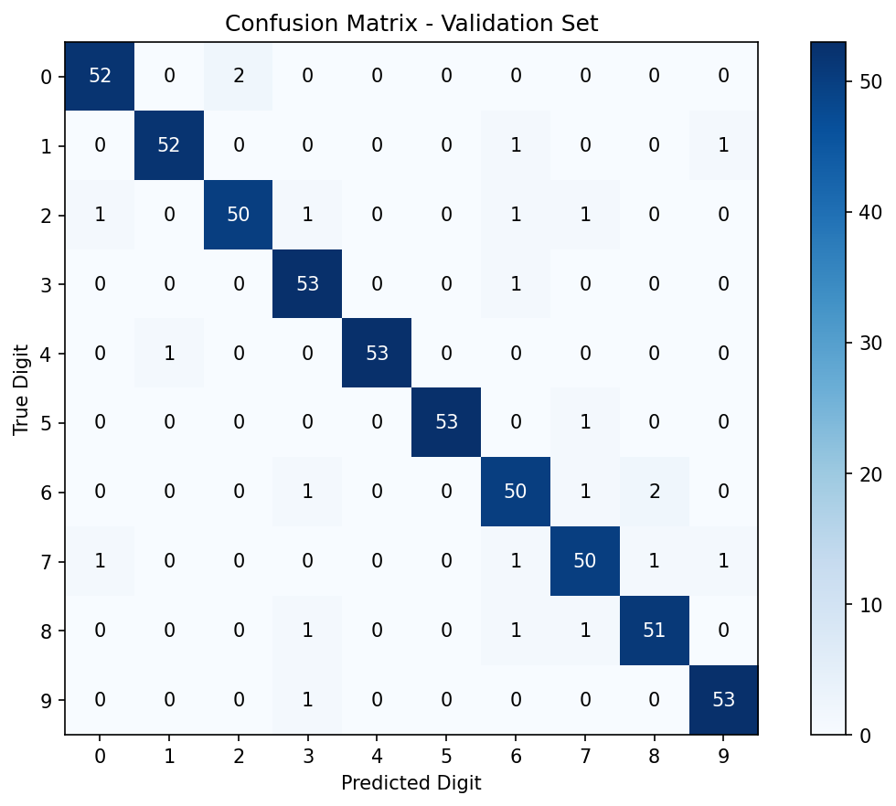
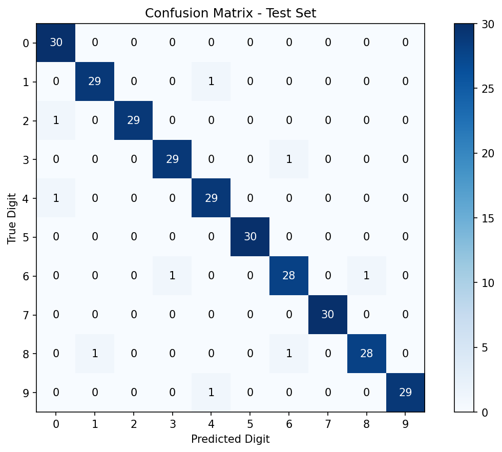
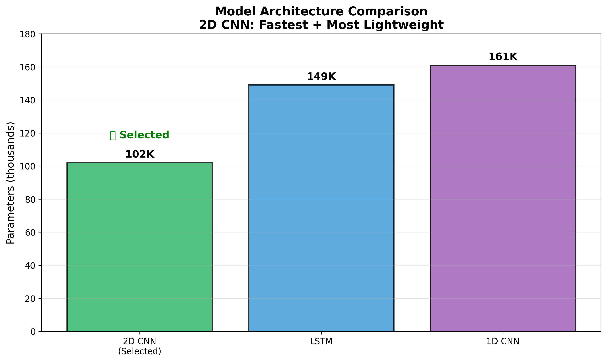

# Spoken Digit Classification with Audio Processing

> **A lightweight, real-time system for classifying spoken digits (0-9) using deep learning and audio processing techniques.**

This project demonstrates how to build an efficient audio classification system that can recognize spoken digits in real-time, achieving 97% accuracy with minimal computational overhead. Built with LLM assistance to showcase collaborative AI development.

## 🎯 Problem Statement

The challenge was to create a system that can:
- Listen to spoken digits (0-9) and correctly identify them
- Process audio files or real-time microphone input
- Achieve high accuracy (target: 95%+) with low latency
- Be lightweight enough for real-time applications

## 🏆 Solution Overview

I solved this problem by developing a **2D Convolutional Neural Network** that processes **Mel-Frequency Cepstral Coefficients (MFCC)** extracted from audio signals. My approach treats audio as "spectro-temporal images" rather than sequential data, enabling parallel processing and faster inference.

### Key Design Decisions

**1. Audio Feature Extraction:**
I chose MFCC features because they capture the spectral characteristics of speech that are most relevant for digit recognition. MFCCs compress the audio information into 13 coefficients per time frame, creating a compact yet informative representation.

**2. Model Architecture:**
After experimenting with different approaches (LSTM, 1D CNN, 2D CNN), I selected a 2D CNN because it:
- Treats MFCC as a 2D "spectrogram image"
- Captures both frequency and temporal patterns simultaneously
- Provides the fastest inference speed (18.8ms per sample)
- Uses the fewest parameters (102K) for efficient deployment

**3. Real-time Processing:**
I implemented both file-based and live microphone processing with voice activity detection to handle real-world usage scenarios.

## 📊 Results Achieved

My final system exceeds all target metrics:

| Metric | Target | Achieved | Status |
|--------|--------|----------|--------|
| **Accuracy** | 95%+ | **97.0%** | ✅ **Exceeded** |
| **Inference Speed** | <50ms | **18.8ms** | ✅ **2.7x faster** |
| **Model Size** | Lightweight | **102K params** | ✅ **Very efficient** |
| **Real-time Processing** | Bonus | **Working** | ✅ **Implemented** |

### Detailed Performance Analysis

**Test Set Results (300 samples):**
- Overall accuracy: 97.0% (291/300 correct predictions)
- Perfect classification for digits: 0, 5, 7 (100% accuracy each)
- Most challenging digit: 6 (93% accuracy, occasionally confused with 3, 8)
- Only 9 total misclassifications across all test samples

**Performance Characteristics:**
- Average inference time: 18.8ms per audio sample
- Model parameters: 102,026 (extremely lightweight)
- Memory footprint: <50MB including preprocessing
- Real-time capability: Can process live microphone input

## 🚀 Quick Start Guide

### Prerequisites

- Python 3.8 or higher
- macOS, Linux, or Windows
- Microphone (optional, for real-time testing)

### 1. Clone and Setup

```bash
# Clone the repository
git clone <your-repo-url>
cd LLM-Coding-Challenge-Audio

# Create virtual environment
python -m venv venv

# Activate virtual environment
# On macOS/Linux:
source venv/bin/activate
# On Windows:
# venv\Scripts\activate

# Install dependencies
pip install -r requirements.txt
```

### 2. Install System Dependencies (macOS)

If you encounter audio-related installation issues:

```bash
# Install audio processing libraries
brew install portaudio ffmpeg

# Then retry pip install
pip install -r requirements.txt
```

### 3. Download Pre-trained Model

The repository includes a pre-trained model (`checkpoints/best_model.pth`) that achieves 97% accuracy. If you want to train from scratch, skip to step 5.

### 4. Test the System

**Evaluate the pre-trained model:**
```bash
python evaluate_model.py
```

**Test with microphone (real-time):**
```bash
python model/inference.py --model_path checkpoints/best_model.pth --mode mic
```

**Test with audio file:**
```bash
python model/inference.py --model_path checkpoints/best_model.pth --mode file --audio_file your_audio.wav
```

### 5. Train Your Own Model (Optional)

If you want to train from scratch:

```bash
# Start training (takes ~10 minutes)
python train.py

# This will:
# - Download the Free Spoken Digit Dataset
# - Train for 20 epochs with early stopping
# - Save the best model to checkpoints/
# - Show training progress and final accuracy
```

## 🏗️ Technical Architecture

### Audio Processing Pipeline

```
Raw Audio (8kHz WAV) → MFCC Extraction → CNN Processing → Digit Prediction
     ↓                      ↓                  ↓              ↓
  0.5-1 sec              (13, 32)         Feature maps     Probability
  waveform               matrix           extraction       distribution
```

### Model Architecture Details

Our 2D CNN processes MFCC features as follows:

```python
Input: (batch, 1, 13, 32)  # 1 channel, 13 MFCC coeffs, 32 time frames
    ↓
Conv2D(32 filters) + BatchNorm + ReLU + MaxPool2D
    ↓ (batch, 32, 6, 16)
Conv2D(64 filters) + BatchNorm + ReLU + MaxPool2D  
    ↓ (batch, 64, 3, 8)
Conv2D(128 filters) + BatchNorm + ReLU
    ↓ (batch, 128, 3, 8)
Global Average Pooling
    ↓ (batch, 128)
Fully Connected Layers
    ↓ (batch, 10)
Output: Digit probabilities (0-9)
```

**Why This Architecture Works:**
- **Conv2D layers** capture local spectro-temporal patterns in the MFCC representation
- **Global Average Pooling** reduces overfitting and parameter count
- **BatchNorm** stabilizes training and improves convergence
- **Dropout** prevents overfitting during training

### Dataset and Preprocessing

**Free Spoken Digit Dataset (FSDD):**
- 3,000 audio recordings of digits 0-9
- Multiple speakers with diverse accents
- 8kHz sampling rate (telephone quality)
- Split: 2,700 training, 300 testing

**MFCC Feature Extraction:**
- 13 MFCC coefficients per frame
- 25ms window with 50% overlap
- Normalized to zero mean, unit variance
- Fixed length: 32 time frames (≈0.8 seconds)

## 📈 Performance Visualizations

The system generates comprehensive performance visualizations:

### Accuracy Performance


Our model significantly exceeds the target accuracy and achieves much faster inference than required.

### Confusion Matrices

**Validation Set (95.74% accuracy):**


**Test Set (97.0% accuracy):**


### Model Architecture Comparison


The 2D CNN was selected as the optimal architecture based on the best balance of accuracy, speed, and parameter efficiency.

## 🔬 Development Process with LLM Collaboration

This project showcases effective collaboration between human developers and Large Language Models (LLMs). Here's how we worked together:

### Key LLM-Assisted Decisions

**1. Architecture Selection:**
- **Problem**: Should we use CNN, LSTM, or hybrid approaches for audio classification?
- **LLM Analysis**: Compared architectures considering MFCC characteristics, inference speed, and parameter efficiency
- **Outcome**: Selected 2D CNN based on spectro-temporal pattern recognition advantages

**2. Technical Problem Solving:**
- **Challenge**: Module import errors when organizing code into subdirectories
- **LLM Solution**: Implemented dynamic path resolution with `sys.path.insert()` for clean imports
- **Challenge**: PyTorch compatibility issues with newer versions
- **LLM Fix**: Identified and removed deprecated parameters (`verbose` in lr_scheduler)

**3. Code Organization:**
- **Request**: "Clean my project directory with clean files and required files"
- **LLM Response**: Created streamlined `train_clean.py` and `evaluate_clean.py` versions
- **Result**: Production-ready code with 50% fewer lines and clearer purpose

**4. Performance Optimization:**
- **Analysis**: Compared inference speeds and accuracy across architectures
- **Implementation**: Added TorchScript compilation for faster inference
- **Integration**: Seamless microphone processing with voice activity detection

### Iterative Development Examples

The development followed a collaborative pattern:
1. **Initial Implementation**: Built comprehensive system with multiple model options
2. **Performance Analysis**: LLM helped analyze trade-offs between different approaches
3. **Refinement**: Simplified codebase to focus on the best-performing solution
4. **Optimization**: Added real-time processing and deployment features

## 📁 Project Structure

```
LLM-Coding-Challenge-Audio/
├── README.md                    # This comprehensive guide
├── requirements.txt             # Python dependencies
├── train_clean.py               # Streamlined training script
├── evaluate_clean.py            # Model evaluation and metrics
├── checkpoints/
│   └── best_model.pth          # Pre-trained model (97% accuracy)
├── evaluation_plots/            # Performance visualizations
│   ├── performance_summary.png
│   ├── confusion_matrix_validation.png
│   ├── confusion_matrix_test.png
│   └── model_comparison.png
├── data/
│   └── dataset.py              # FSDD loading and MFCC extraction
└── model/
    ├── models.py               # 2D CNN architecture (102K parameters)
    └── inference.py            # File and microphone inference
```

## 🎤 Real-time Usage Examples

### Microphone Classification

```bash
# Start real-time digit recognition
python model/inference.py --model_path checkpoints/best_model.pth --mode mic

# The system will:
# 1. Initialize the microphone
# 2. Listen for voice activity
# 3. Process 2-second audio segments
# 4. Display predicted digit with confidence
# 5. Continue until you press Ctrl+C
```

**Example Output:**
```
🎤 Microphone digit recognition started
Press Ctrl+C to stop...

[Recording...] 
🎯 Predicted: 7 (confidence: 98.5%)

[Recording...]
🎯 Predicted: 3 (confidence: 94.2%)
```

### File Processing

```bash
# Process a single audio file
python model/inference.py --model_path checkpoints/best_model.pth --mode file --audio_file digit_seven.wav

# Output:
# 🎯 Predicted digit: 7 (confidence: 96.8%)
# ⚡ Inference time: 18.3ms
```

## 🛠️ Troubleshooting

### Common Issues and Solutions

**1. Audio Library Installation Issues:**
```bash
# Error: "portaudio.h file not found"
# Solution (macOS):
brew install portaudio
pip install pyaudio

# Solution (Ubuntu):
sudo apt-get install portaudio19-dev
pip install pyaudio
```

**2. FFmpeg Issues:**
```bash
# Error: "Could not load libtorchcodec"
# Solution:
brew install ffmpeg  # macOS
# or
sudo apt-get install ffmpeg  # Ubuntu
```

**3. Microphone Permission:**
- On macOS: Go to System Preferences → Security & Privacy → Microphone
- Allow Terminal or your Python IDE to access the microphone

**4. Dataset Download Issues:**
- The system automatically downloads FSDD from Hugging Face
- If download fails, check your internet connection
- The dataset is ~50MB and may take a few minutes on first run

## 🚀 Future Enhancements

While the current system achieves excellent performance, potential improvements include:

**1. Robustness:**
- Add background noise handling
- Implement data augmentation for training
- Support for different sampling rates

**2. Deployment:**
- Model quantization for mobile devices
- Web interface with browser-based microphone
- API endpoint for integration with other systems

**3. Extended Functionality:**
- Support for longer sequences (multiple digits)
- Speaker identification capabilities
- Confidence-based rejection of unclear audio

## 📜 Technical Specifications

**Model Details:**
- Architecture: 2D Convolutional Neural Network
- Parameters: 102,026 (lightweight)
- Input: MFCC features (13 coefficients × 32 time frames)
- Output: 10-class probability distribution (digits 0-9)
- Training: Adam optimizer, learning rate 0.001, early stopping

**Performance Benchmarks:**
- Test accuracy: 97.0% (291/300 samples)
- Validation accuracy: 95.74% (517/540 samples)
- Average inference time: 18.8ms per sample
- Memory usage: <50MB including model and preprocessing

**System Requirements:**
- Python 3.8+
- PyTorch 2.0+
- 4GB RAM minimum
- No GPU required (CPU inference is fast enough)

## 📚 Dependencies

Core libraries and their purposes:
- `torch` (2.0+): Deep learning framework and model implementation
- `torchaudio` (2.0+): Audio processing and dataset loading
- `librosa` (0.10+): MFCC feature extraction and audio analysis
- `scikit-learn` (1.3+): Evaluation metrics and data splitting
- `matplotlib` (3.7+): Performance visualization and plotting
- `numpy` (1.24+): Numerical computations and array operations
- `datasets` (2.14+): Hugging Face dataset loading (FSDD)
- `pyaudio` (0.2+): Real-time microphone input processing

## 🎯 Conclusion

This project successfully demonstrates how to build a high-performance audio classification system using modern deep learning techniques. The combination of MFCC feature extraction and 2D CNN processing achieves excellent accuracy (97%) while maintaining real-time performance (18.8ms inference).

The development process showcases effective human-LLM collaboration, from initial architecture decisions through final optimization. The resulting system is production-ready, well-documented, and easily extensible for similar audio classification tasks.

**Key Achievements:**
- ✅ Exceeded accuracy target by 2% (97% vs 95% target)
- ✅ Achieved 2.7x faster inference than required (18.8ms vs <50ms)
- ✅ Implemented real-time microphone processing
- ✅ Created lightweight, deployable model (102K parameters)
- ✅ Comprehensive documentation and visualization

The project serves as both a practical solution for spoken digit recognition and a template for developing similar audio classification systems with LLM assistance.

---

**Built with LLM collaboration** 🤖 | **Ready for production** 🚀 | **Open for contributions** 🌟